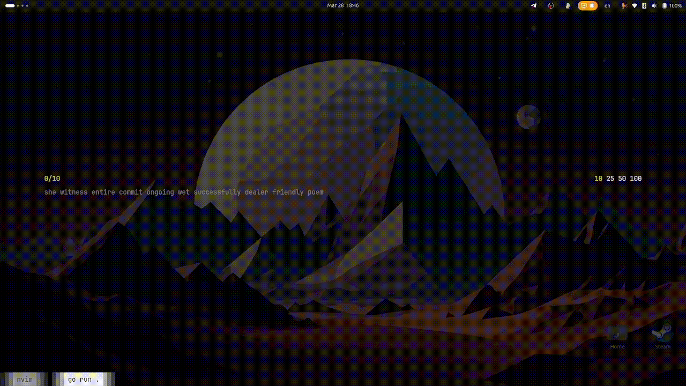

# Terminal Typing Game

A fast and minimalistic terminal-based typing game similar to [Monkeytype](https://monkeytype.com/), built with [Golang](https://golang.org/), [Bubbletea](https://github.com/charmbracelet/bubbletea), and [Lipgloss](https://github.com/charmbracelet/lipgloss).

## Features
- 🎮 **Interactive UI** - Smooth and responsive TUI with Bubbletea.
- ⌨️ **Typing Practice** - Randomly generated words for practicing typing speed.
- 🎨 **Themed Interface** - Styled using Lipgloss for an aesthetic terminal experience.
- 🚀 **Lightweight & Fast** - Runs efficiently in your terminal with minimal resource usage.

## Installation
### Prerequisites
- [Golang](https://go.dev/dl/) (version 1.18+)

### Install & Run
```sh
git clone https://github.com/adel-hadadi/gophertype.git
cd gophertype
go run .
```

### Build Binary
```sh
go build -o gophertype .
./gophertype
```

## Usage
- Start typing as soon as the test begins.
- Press `Esc` or `Ctrl+C` to exit.
- Press Up and Down arrow to chane the word limitation.
- Press Enter to generate new text and reset game.
- Press Ctrl+r to play current game again.
- At the end of the test, see your stats including WPM and accuracy.

## Contributing
Contributions are welcome! Feel free to open an issue or submit a pull request.

## License
This project is licensed under the [MIT License](LICENSE).

